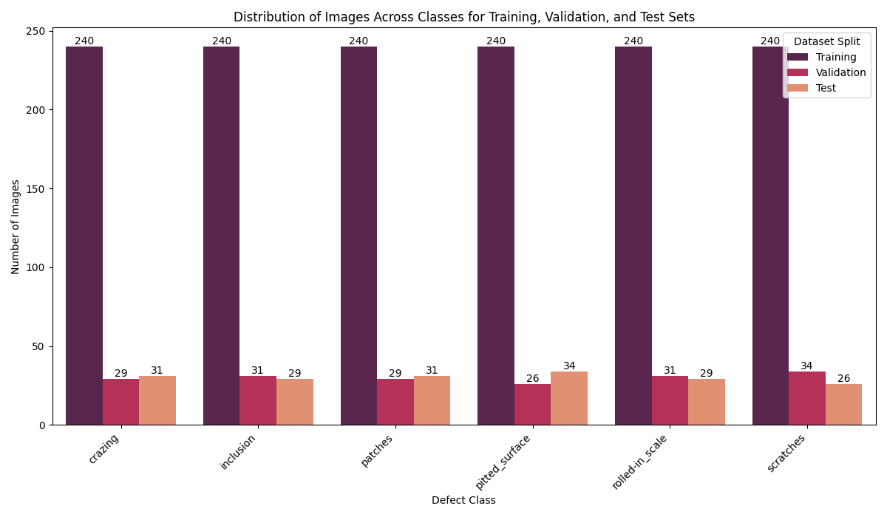

# Industrial_Surface_Defect_Classification

## 📝Short Description
Automated classification of metal surface defects using Deep Learning. Optimized for Edge-AI applications through efficient architecture design and minimized computational overhead.

##  1. 🔍 Project Overview
In industrial manufacturing (Smart Factory), manual surface inspection is slow, subjective, and prone to human error. This project demonstrates an automated pipeline for detecting defects on steel strips. The focus is on developing a model that is not only accurate but also fast enough to be deployed on embedded systems directly at the production line (Edge-AI).

## 🏗️ 2. Model Architecture
The **MobileNetV3-Small** architecture was selected for this project due to its excellent balance between latency and accuracy.
* **Input Layer:** Modified to **1-channel Grayscale** to reduce data throughput and FLOPS by approximately 66% compared to RGB images.
* **Transfer Learning:** Leveraged pre-trained ImageNet weights for efficient feature extraction.
* **Classifier Head:** Custom fully connected layer tailored for 6 specific defect classes.
* **Optimization:** Adam Optimizer with a learning rate of 0.003 and Cross-Entropy Loss.

## 📂 3. Dataset Details
The model utilizes the **NEU Surface Defect Database**, an industry benchmark for surface inspection.
* **Content:** 1,800 images of steel strips.
* **Classes (6):** Crazing, Inclusion, Patches, Pitted Surface, Rolled-in Scale, and Scratches.
* **Preprocessing:** Resized to 224x224 pixels, normalized, and converted to grayscale.

### Datavisualization

## 🛠️ Technical Stack
* **Language:** Python
* **Framework:** Pytorch, Torchvision
* **Data Processing:** Scikit_learn, Matplotlib, NumPy
* **Environment:** Google Colab /Jupyter Notebook

## 📊 4. Evaluation and Insights
Model performance is measured on an independent test dataset (Hold-out set).

* **Final Accuracy:** [Insert Value]%
* **Inference Latency:** [Insert Value] ms (Measured on CPU /GPU).

### 📉 Analysis of Results
Evaluation is conducted via a **Confusion Matrix** to determine if certain defect patterns

## 🚀 6. Future Improvements & Road Map
This is a **First Draft** of the project. In professional industrial environments, the following enhancements would be implemented:
* **K-Fold Cross-Validation:** To statistically validate results given the limited dataset size.
* **Post-Training Quantization:** Converting the model to INT8 format to further accelerate performance on specialized edge hardware.
* **Data Augmentation Expansion:** Implementing Synthetic Data (GANs) to increase robustness against varying lighting conditions in the factory.

## Summary

---
*Note: This is an ongoing project. Final metrics and visualizations will be updated upon completion of the final training cycles.*
